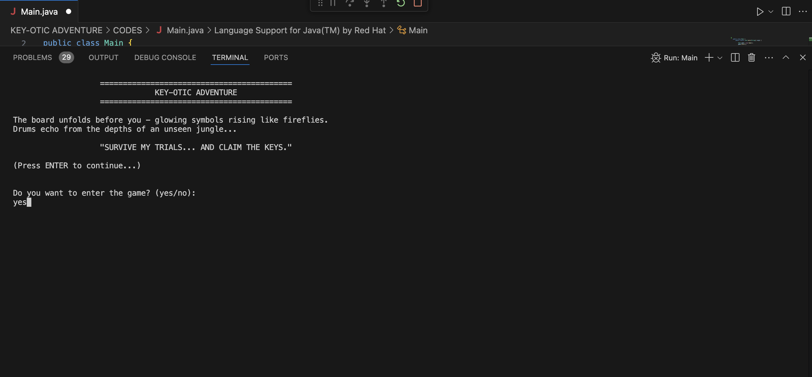
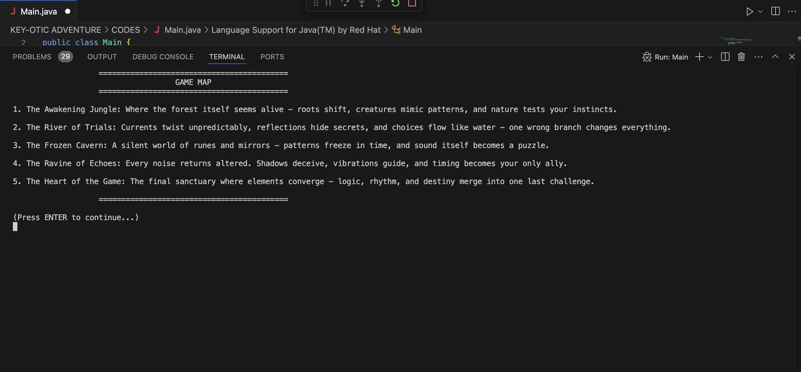
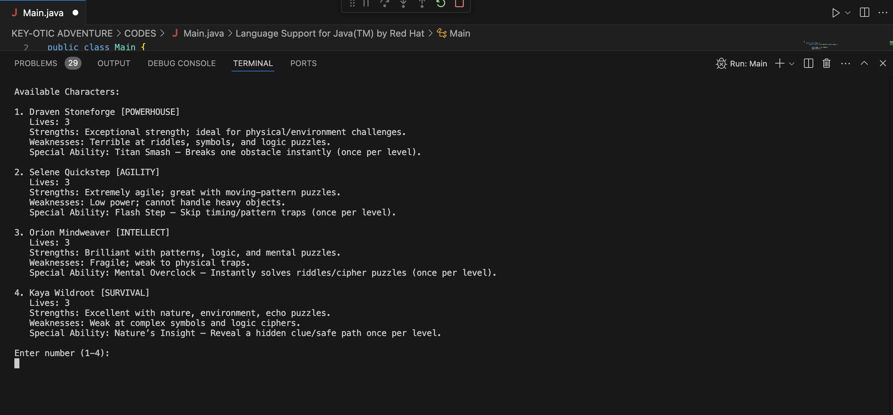
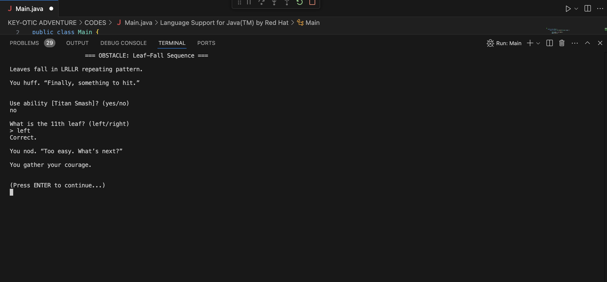
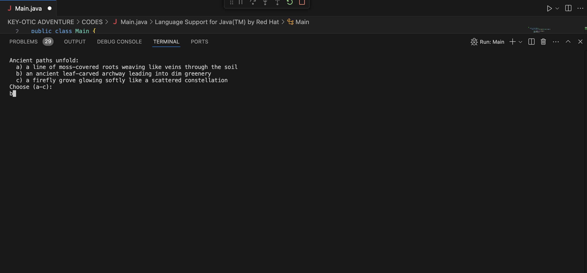
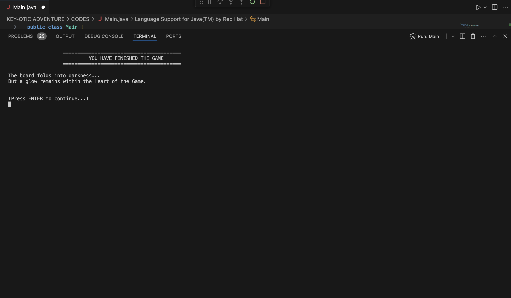

<h1 align="center">ੈ✩‧₊˚ Key-otic Adventure – A Console-Based OOP Puzzle Game‧₊˚✩ ੈ</h1>

<p align="center">
  
</p>

---

## **Overview**
**Key-otic Adventure** is a story-driven Java console game inspired by escape rooms and Jumanji-style game worlds.  
You play as a trapped adventurer who must complete five levels, solve puzzles, choose paths, and switch between unique characters to survive.

Each level contains:
- 🧩 **Puzzles**
- 🧭 **Directional choices**
- 🔑 **Items to collect**
- 📜 **Multiple outcomes**

Your ultimate goal: **Unlock the Final Chest containing the Ultimate Gem**—your only way home.

---

## ✎ **Project Structure**

```bash
📁 KEY-OTIC ADVENTURE/CODES
    ├── 📁 sounds/
    ├── 📁 images/
    ├── 🧍 Characters.java
    ├── 💬 DialogueLibrary.java
    ├── 🕹️ Game.java
    ├── 🎒 Items.java
    ├── 🗺️ Levels.java
    ├── 📄 Main.java
    ├── 🧩 Puzzles.java
    └── 🔊 SoundPlayer.java
```
- **Main.java** — Launches the game.  
- **Game.java** — Manages the main gameplay loop, puzzles, and progression.  
- **Characters.java** — Defines character roles, abilities, and stats.  
- **Items.java** — Manages item storage and utility functions.  
- **DialogueLibrary.java** — Generates unique character reactions.  
- **Levels.java** — Contains all level classes extending `LevelBase`.  
- **Puzzles.java** — Holds all puzzle definitions and mechanics.  
- **SoundPlayer.java** — Handles music and sound playback.  
- **sounds/** — Contains sound effects used in the game.  
- **images/** — Contains images used in the README.

---
<h1 align="center">「 ✦ How to Play ✦ 」 </h1>

<div align="center">

<table>
<tr>
<td align="center">
  
### **1. Enter the Game**  
<br>
*Main Interface*

</td>
<td align="center">

### **2. Game Map**  
<br>
*View all regions before beginning.*

</td>
</tr>

<tr>
<td align="center">

### **3. Character Selection**  
<br>
*Choose your hero and ability.*

</td>
<td align="center">

### **4. Puzzle Challenges**  
<br>
*Solve pattern, rhythm, and logic puzzles.*

</td>
</tr>

<tr>
<td align="center">

### **5. Path & Direction Choices**  
<br>
*Decide your route and actions.*

</td>
<td align="center">

### **6. Game Completion**  
<br>
*Reach the Heart of the Game.*

</td>
</tr>
</table>

</div>
---
<h1 align="center">「 ✦ Character Showcase ✦ 」 </h1>

<p align="center">
  
</p>


<small>
<table width="100%" style="border-collapse: collapse;" border="1">
  <tr style="background-color: #f0f0f0;">
    <th colspan="2">Draven Stoneforge (The Powerhouse)</th>
    <th>Character</th>
  </tr>
  <tr>
    <td><b>Role</b></td>
    <td>Powerhouse / Fighter</td>
    <td rowspan="5" align="center">
      
    </td>
  </tr>
  <tr>
    <td><b>Strengths</b></td>
    <td>- Very high Power<br>- Immune to animal attacks once per level<br>- Breaks physical barriers</td>
  </tr>
  <tr>
    <td><b>Weaknesses</b></td>
    <td>- Very low Intelligence<br>- Struggles with riddles, codes, logic puzzles<br>- Takes double damage from mental traps</td>
  </tr>
  <tr>
    <td><b>Special Ability</b></td>
    <td><b>Titan Smash</b>: Breaks one obstacle without solving puzzle (once per level)</td>
  </tr>
  <tr>
    <td><b>Stats</b></td>
    <td>Power: ⭐⭐⭐⭐⭐ | Intelligence: ⭐ | Agility: ⭐⭐⭐ | Survival: ⭐⭐⭐⭐ | Lives: 3</td>
  </tr>
</table>
</small>

<small>
<table width="100%" style="border-collapse: collapse;" border="1">
  <tr style="background-color: #f0f0f0;">
    <th colspan="2">Selene Quickstep (The Agility Specialist)</th>
    <th>Character</th>
  </tr>
  <tr>
    <td><b>Role</b></td>
    <td>Speed / Escape Artist</td>
    <td rowspan="5" align="center">
      
    </td>
  </tr>
  <tr>
    <td><b>Strengths</b></td>
    <td>- Dodges traps automatically<br>- Perfect for timing puzzles<br>- Crosses unstable terrain without falling</td>
  </tr>
  <tr>
    <td><b>Weaknesses</b></td>
    <td>- Low Power<br>- Cannot lift heavy items or break doors<br>- Fails strength-based tasks unless using an item</td>
  </tr>
  <tr>
    <td><b>Special Ability</b></td>
    <td><b>Flash Step</b>: Skip one timing-based puzzle</td>
  </tr>
  <tr>
    <td><b>Stats</b></td>
    <td>Power: ⭐⭐ | Intelligence: ⭐⭐⭐ | Agility: ⭐⭐⭐⭐⭐ | Survival: ⭐⭐ | Lives: 3</td>
  </tr>
</table>

<br>

<table width="100%" style="border-collapse: collapse;" border="1">
  <tr style="background-color: #f0f0f0;">
    <th colspan="2">Orion Mindweaver (The Puzzle Master)</th>
    <th>Character</th>
  </tr>
  <tr>
    <td><b>Role</b></td>
    <td>Intelligence / Decoder</td>
    <td rowspan="5" align="center">
      
    </td>
  </tr>
  <tr>
    <td><b>Strengths</b></td>
    <td>- Excels at riddles, clues, cipher puzzles<br>- Gains extra hint for any puzzle<br>- Analyzes rooms to reduce trap danger</td>
  </tr>
  <tr>
    <td><b>Weaknesses</b></td>
    <td>- Fragile — low survival and power<br>- Takes double damage from physical traps</td>
  </tr>
  <tr>
    <td><b>Special Ability</b></td>
    <td><b>Mental Overclock</b>: Instantly solves ONE riddle or cipher (once per level)</td>
  </tr>
  <tr>
    <td><b>Stats</b></td>
    <td>Power: ⭐ | Intelligence: ⭐⭐⭐⭐⭐ | Agility: ⭐⭐ | Survival: ⭐⭐ | Lives: 3</td>
  </tr>
</table>

<br>

<table width="100%" style="border-collapse: collapse;" border="1">
  <tr style="background-color: #f0f0f0;">
    <th colspan="2">Kaya Wildroot (The Navigator)</th>
    <th>Character</th>
  </tr>
  <tr>
    <td><b>Role</b></td>
    <td>Survival / Navigator / Nature Expert</td>
    <td rowspan="5" align="center">
      
    </td>
  </tr>
  <tr>
    <td><b>Strengths</b></td>
    <td>- Knows safe paths automatically<br>- Immune to poison, plants, and natural traps<br>- Gains extra items from nature-themed puzzles</td>
  </tr>
  <tr>
    <td><b>Weaknesses</b></td>
    <td>- Low Intelligence for complex logic puzzles<br>- Cannot decode advanced symbols without help</td>
  </tr>
  <tr>
    <td><b>Special Ability</b></td>
    <td><b>Nature’s Insight</b>: Reveals one hidden clue or safe path per level</td>
  </tr>
  <tr>
    <td><b>Stats</b></td>
    <td>Power: ⭐⭐⭐ | Intelligence: ⭐⭐ | Agility: ⭐⭐⭐⭐ | Survival: ⭐⭐⭐⭐⭐ | Lives: 3</td>
  </tr>
</table>
</small>


---

## 𖤐 **OOP Concepts Applied**

### **1. Encapsulation** ༉‧₊˚.
- Character stats (`power`, `intelligence`, `lives`, etc.) are private.
- Inventory and item storage use encapsulated data.
- Puzzle answers and internal logic remain protected.
- Access is through getters and controlled methods.

**Example: `Characters.java`**

The `Character` class keeps its data hidden using **private fields** and exposes only safe, controlled access through public methods.

```java
// Characters.java
public static class Character {
    
    // Data is private and hidden
    private int lives;
    
    // Access is controlled via methods
    public void loseLives(int amt) {
        lives -= amt;
        if (lives < 0) lives = 0; // Guardrail against negative lives
    }
    
    public boolean isAlive() { 
        return lives > 0; // Controlled read access
    }
}
```
### **2. Polymorphism** ༉‧₊˚.
- Characters respond differently to puzzles using overridden dialogue.
- Each character's ability changes puzzle outcomes.
- Puzzles accept different valid outcomes depending on the character/item used.

**Example: Damage Calculation (`Puzzles.java`)**

The `computeLifeLoss` method in `Puzzles.java` calculates damage differently depending on the `CharacterType` interacting with the puzzle.

| Character Type | Damage Logic | Reference |
| :--- | :--- | :--- |
| `DRAVEN` (Powerhouse) | Takes **2 life** loss on `RIDDLE`, `CIPHER`, or `LOGIC` puzzles. | `if (kind == PuzzleKind.RIDDLE...` |
| `SELENE` (Agility) | Takes **2 life** loss if the puzzle is `ENVIRONMENT` and contains the word "heavy". | `if (kind == PuzzleKind.ENVIRONMENT && ...` |
| `ORION` (Intellect) | Takes **2 life** loss on `TIMING` or `ENVIRONMENT` puzzles. | `if (kind == PuzzleKind.TIMING...` |

```java
// Puzzles.java
private int computeLifeLoss(Characters.Character c) {
    int base = 1;

    // Polymorphic behavior based on the object's type
    return switch (c.getType()) { 
        case DRAVEN -> {
            // Draven has a higher penalty for intellect-based puzzles
            if (kind == PuzzleKind.RIDDLE || kind == PuzzleKind.CIPHER || kind == PuzzleKind.LOGIC)
                yield 2;
            yield base;
        }
        case SELENE -> {
            // Selene has a higher penalty for heavy physical challenges
            if (kind == PuzzleKind.ENVIRONMENT && intro.toLowerCase().contains("heavy"))
                yield 2;
            yield base;
        }
        // ... and so on for all character types
    };
}
```
### **3. Abstraction** ༉‧₊˚.
- `Puzzle.java` → Handles puzzle logic  
- `Levels.java` → Manages progression  
- `Items.java` → Inventory and item handling  
- `Game` only interacts with exposed methods.

**Example: Level Structure (`Levels.java`)**

The `LevelBase` class acts as the abstract blueprint for all levels.  
It defines *what a level must provide* (such as puzzles and a level number) without revealing *how* each level generates its own content.

```java
// Levels.java: The abstract methods define what the Level MUST do.
public abstract static class LevelBase {
    
    // Abstraction: The Game class knows that a level provides puzzles,
    // but it doesn't need to know HOW Level 1 creates its puzzle list.
    public abstract List<Puzzles.Puzzle> getPuzzles();
    
    // The complex logic of playing a level (shuffling puzzles, handling retries, 
    // managing narration, failure loops, etc.) is implemented here and hidden 
    // from the Game loop.
    public boolean play(Game game) { 
        // ... (30+ lines of implementation details)
    }
}
```

### **4. Inheritance** ༉‧₊˚.
- All levels inherit from `LevelBase`.
- Puzzle types share structure in the `Puzzle` class.
- Potential extension for future enemy or boss subclasses.

**Example:** `Levels.java`

   All specific level classes (`Level1`, `Level2`, etc.) inherit fundamental behavior from the abstract class `LevelBase`.
  

```java
// Levels.java: The LevelBase class defines the common structure.
public abstract static class LevelBase {

    // Abstract methods must be implemented by all subclasses.
    public abstract List<Puzzles.Puzzle> getPuzzles(); // Unique puzzles per level
    public abstract int getLevelNumber();              // Unique number per level

    // This concrete method is reused by all subclasses.
    public boolean play(Game game) {
        // ... common setup, sound playing, puzzle selection loop ...
        return true;
    }
}
```
---

## ▶️ **How to Run the Program**

### **Compile**
```bash
javac Main.java

```

---

## ⋆˚౨ৎ ⋆.˚Acknowledgment⋆˚౨ৎ ⋆.˚

We sincerely express our gratitude to our instructor for the guidance, support, and insights shared throughout this project.  Their expertise greatly helped deepen our understanding of Object-Oriented Programming.

We also thank our classmates and peers for their cooperation, feedback, and encouragement, which contributed to improving the overall quality of this work.

This project reflects a collaborative effort, and we appreciate everyone who contributed to its completion.

---

## 🕸 Disclaimer

This project was developed for academic purposes under **CS 211 — Object-Oriented Programming**.  It is intended only as a reference. Please avoid copying or submitting it as your own work.

---

## Other Sections ⤶

### **a. Future Enhancements**
- Add saving/loading system  
- Add GUI version (JavaFX)  
- Improve AI behavior for enemies  
- Add more puzzle types (logic grid, sequence decoding)  
- Add achievements and secret endings  

### **b. References**
- Oracle Java Documentation  
- StackOverflow community discussions  
- W3Schools Java tutorials  
- GeeksForGeeks OOP resources  


<h1 align="center">「 ✦ Contributors ✦ 」</h1>

<div align="center">

<table>
<tr>

<!-- Member 1 -->
<td align="center" width="250">


<br><br>

<a href="https://github.com/cindymortel-cs" target="_blank">
  
</a>

<br>
<strong>@cindymortel-cs</strong>

</td>

<!-- Member 2 -->
<td align="center" width="250">


<br><br>

<a href="https://github.com/Laurenzedc" target="_blank">
  
</a>

<br>
<strong>@Laurenzedc</strong>

</td>

<!-- Member 3 -->
<td align="center" width="250">


<br><br>

<a href="https://github.com/rechelalala" target="_blank">
  
</a>

<br>
<strong>@rechelalala</strong>

</td>

</tr>
</table>

</div>

