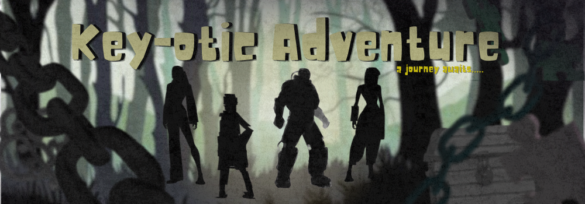
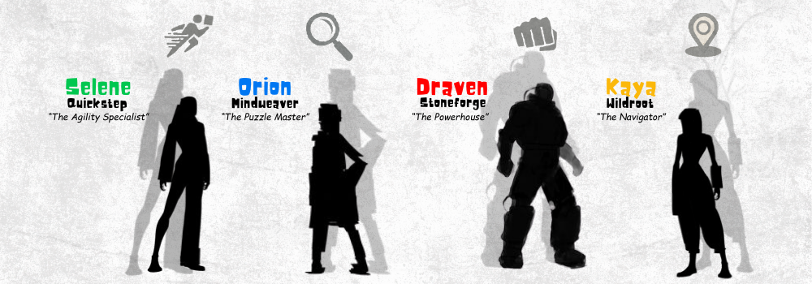
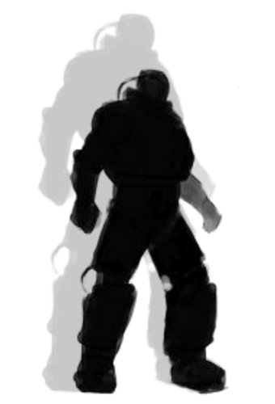

<h1 align="center">✨ Key-otic Adventure – A Console-Based OOP Puzzle Game ✨</h1>

<p align="center">
  
</p>

---

## **Overview**
**Key-otic Adventure** is a story-driven Java console game inspired by escape rooms and Jumanji-style game worlds.  
You play as a trapped adventurer who must complete five levels, solve puzzles, choose paths, and switch between unique characters to survive.

Each level contains:
- 🧩 **Puzzles**
- 🧭 **Directional choices**
- 🔑 **Items to collect**
- 📜 **Multiple outcomes**

## 🗃️ **Project Structure**
 src/
│── Main.java              
│── Game.java              
│── Characters.java        
│── Items.java             
│── DialogueLibrary.java   
│── Levels.java            
│── Puzzles.java           
└── SoundPlayer.java       

Your ultimate goal: **Unlock the Final Chest containing the Ultimate Gem**—your only way home.

---
<h1 align="center">🧙‍♂️ Character Descriptions</h1>

<p align="center">
  
</p>


<small>
<table width="100%" style="border-collapse: collapse;" border="1">
  <tr style="background-color: #f0f0f0;">
    <th colspan="2">Draven Stoneforge (The Powerhouse)</th>
    <th>Character</th>
  </tr>
  <tr>
    <td><b>Role</b></td>
    <td>Powerhouse / Fighter</td>
    <td rowspan="5" align="center">
      
    </td>
  </tr>
  <tr>
    <td><b>Strengths</b></td>
    <td>- Very high Power<br>- Immune to animal attacks once per level<br>- Breaks physical barriers</td>
  </tr>
  <tr>
    <td><b>Weaknesses</b></td>
    <td>- Very low Intelligence<br>- Struggles with riddles, codes, logic puzzles<br>- Takes double damage from mental traps</td>
  </tr>
  <tr>
    <td><b>Special Ability</b></td>
    <td><b>Titan Smash</b>: Breaks one obstacle without solving puzzle (once per level)</td>
  </tr>
  <tr>
    <td><b>Stats</b></td>
    <td>Power: ⭐⭐⭐⭐⭐ | Intelligence: ⭐ | Agility: ⭐⭐⭐ | Survival: ⭐⭐⭐⭐ | Lives: 3</td>
  </tr>
</table>
</small>

<small>
<table width="100%" style="border-collapse: collapse;" border="1">
  <tr style="background-color: #f0f0f0;">
    <th colspan="2">Selene Quickstep (The Agility Specialist)</th>
    <th>Character</th>
  </tr>
  <tr>
    <td><b>Role</b></td>
    <td>Speed / Escape Artist</td>
    <td rowspan="5" align="center">
      
    </td>
  </tr>
  <tr>
    <td><b>Strengths</b></td>
    <td>- Dodges traps automatically<br>- Perfect for timing puzzles<br>- Crosses unstable terrain without falling</td>
  </tr>
  <tr>
    <td><b>Weaknesses</b></td>
    <td>- Low Power<br>- Cannot lift heavy items or break doors<br>- Fails strength-based tasks unless using an item</td>
  </tr>
  <tr>
    <td><b>Special Ability</b></td>
    <td><b>Flash Step</b>: Skip one timing-based puzzle</td>
  </tr>
  <tr>
    <td><b>Stats</b></td>
    <td>Power: ⭐⭐ | Intelligence: ⭐⭐⭐ | Agility: ⭐⭐⭐⭐⭐ | Survival: ⭐⭐ | Lives: 3</td>
  </tr>
</table>

<br>

<table width="100%" style="border-collapse: collapse;" border="1">
  <tr style="background-color: #f0f0f0;">
    <th colspan="2">Orion Mindweaver (The Puzzle Master)</th>
    <th>Character</th>
  </tr>
  <tr>
    <td><b>Role</b></td>
    <td>Intelligence / Decoder</td>
    <td rowspan="5" align="center">
      
    </td>
  </tr>
  <tr>
    <td><b>Strengths</b></td>
    <td>- Excels at riddles, clues, cipher puzzles<br>- Gains extra hint for any puzzle<br>- Analyzes rooms to reduce trap danger</td>
  </tr>
  <tr>
    <td><b>Weaknesses</b></td>
    <td>- Fragile — low survival and power<br>- Takes double damage from physical traps</td>
  </tr>
  <tr>
    <td><b>Special Ability</b></td>
    <td><b>Mental Overclock</b>: Instantly solves ONE riddle or cipher (once per level)</td>
  </tr>
  <tr>
    <td><b>Stats</b></td>
    <td>Power: ⭐ | Intelligence: ⭐⭐⭐⭐⭐ | Agility: ⭐⭐ | Survival: ⭐⭐ | Lives: 3</td>
  </tr>
</table>

<br>

<table width="100%" style="border-collapse: collapse;" border="1">
  <tr style="background-color: #f0f0f0;">
    <th colspan="2">Kaya Wildroot (The Navigator)</th>
    <th>Character</th>
  </tr>
  <tr>
    <td><b>Role</b></td>
    <td>Survival / Navigator / Nature Expert</td>
    <td rowspan="5" align="center">
      
    </td>
  </tr>
  <tr>
    <td><b>Strengths</b></td>
    <td>- Knows safe paths automatically<br>- Immune to poison, plants, and natural traps<br>- Gains extra items from nature-themed puzzles</td>
  </tr>
  <tr>
    <td><b>Weaknesses</b></td>
    <td>- Low Intelligence for complex logic puzzles<br>- Cannot decode advanced symbols without help</td>
  </tr>
  <tr>
    <td><b>Special Ability</b></td>
    <td><b>Nature’s Insight</b>: Reveals one hidden clue or safe path per level</td>
  </tr>
  <tr>
    <td><b>Stats</b></td>
    <td>Power: ⭐⭐⭐ | Intelligence: ⭐⭐ | Agility: ⭐⭐⭐⭐ | Survival: ⭐⭐⭐⭐⭐ | Lives: 3</td>
  </tr>
</table>
</small>


---

## 🧱 **OOP Concepts Applied**

### 🔒 **1. Encapsulation**
- Character stats (`power`, `intelligence`, `lives`, etc.) are private.
- Inventory and item storage use encapsulated data.
- Puzzle answers and internal logic remain protected.
- Access is through getters and controlled methods.

### 🎭 **2. Polymorphism**
- Characters respond differently to puzzles using overridden dialogue.
- Each character's ability changes puzzle outcomes.
- Puzzles accept different valid outcomes depending on the character/item used.

### 🧩 **3. Abstraction**
- `Puzzle.java` → Handles puzzle logic  
- `Levels.java` → Manages progression  
- `Items.java` → Inventory and item handling  
- `Game` only interacts with exposed methods.

### 🧬 **4. Inheritance**
- All levels inherit from `LevelBase`.
- Puzzle types share structure in the `Puzzle` class.
- Potential extension for future enemy or boss subclasses.

---

## ▶️ **How to Run the Program**

### **Compile**
```bash
javac Main.java

```

## 📚 Other Sections

### **a. Future Enhancements**
- Add saving/loading system  
- Add GUI version (JavaFX)  
- Improve AI behavior for enemies  
- Add more puzzle types (logic grid, sequence decoding)  
- Add achievements and secret endings  

### **b. References**
- Oracle Java Documentation  
- StackOverflow community discussions  
- W3Schools Java tutorials  
- GeeksForGeeks OOP resources  

